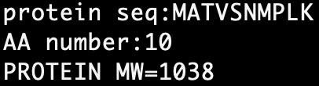
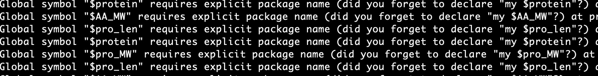
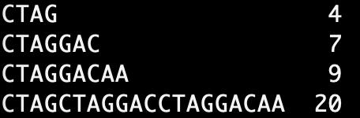
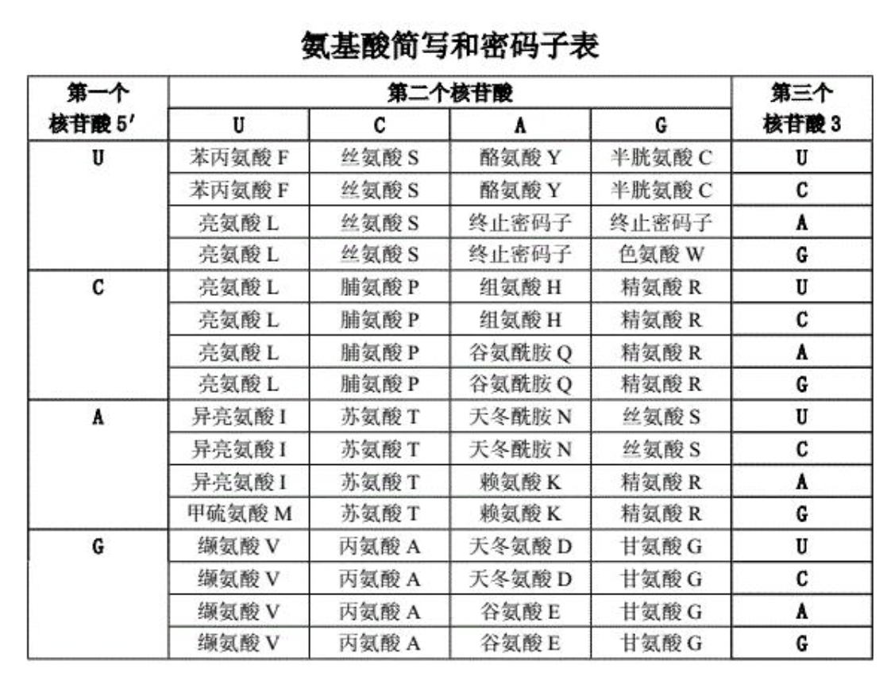

# Perl语言学习笔记


## 一、Perl 语言简介

 **Perl**：实用报表提取语言

（Practical Extraction and Report Language）

设计者：Larry Wall

特性：正则表达式功能、第三方代码库CPAN

特点：开源运行、支持跨平台、直接运行，无需复杂编译、内部集成正则表达式、CPAN模块库。

无需定义各种变量和各种变量的类型，灵活。


**为什么Perl语言适合处理生物数据？**

正则表达是善于处理字符串；脚本语言，善于批量化和流程化；很多生物学软件用Perl语言编写。

应用举例：统计序列ATCG含量、基因组GC含量、基因数、将核酸序列翻译成氨基酸序列、从序列中提取制定的片段进行碱基互补配对。

 

UNIX类系统平台和Mac OS上默认安装了Perl，在命令行输入`perl -v`，查看系统是否安装了Perl，目前最常用的版本为**Perl 5**。

Windows: **Strawberry Perl**或者**ActivePerl**

**尝试使用Perl来编写第一个程序吧！“

```
$ vi 001.pl
```

打开vi/vim

```perl
#!/bin/user/perl
#This is my first program
print "Hello world!\n";
```

注意：在Unix系统里，如果文本文件开头的最前两个字符是**`#！`**，那么后面跟着的就是用来执行这个文件的程序路径。（缺乏可移植性）。

这里：**Shebang**（也称为**Hashbang**）是一个由[井号](https://zh.wikipedia.org/wiki/井号)和[叹号](https://zh.wikipedia.org/wiki/叹号)构成的字符序列`#!`，其出现在文本文件的第一行的前两个字符。开头字符之后，可以有一个或数个空白字符，后接解释器的[绝对路径](https://zh.wikipedia.org/w/index.php?title=绝对路径&action=edit&redlink=1)，用于调用解释器。

退出vi/vim

```perl
$ perl 001.pl
Hello world!
```

在Perl 5.10及其后续版本中还有另一种改良写法，不用`print`改用`say`，效果基本相同，但却不需要输入换行符。（实践中建议用say）

```perl
use feature qw(say);    #注释
say "Hello World!";
```

⚠注释：如果出现以下报错，需要输入此行代码。

> String found where operator expected at Hello_world.pl line 1, near "say "Hello World!""	(Do you need to predeclare say?)syntax error at Hello_world.pl line 1, near "say "Hello World!""


**Perl内建文档**：**perldoc**

```perl
# 举例
$ perdoc perldata
$ perldoc -f print
```

> **perldoc相关参数**
>
> `perlrequick`：Perl正则表达式快览
>
> `perlretut`：Perl正则表达式教程
>
> `perlootut`：Perl面向对象编程初学者教程
>
> `perlsyn`：Perl语法
>
> `perldata`：Perl数据结构
>
> `perlsub`: Perl自定义函数（子函数）
>
> `perlfunc`: Perl内置函数
>
> `perlop`:操作符与优先权

**Perl编程案例：过滤BLAST比对结果**

```
vi blast_filter.pl
```

进入vi/vim

```perl
#!/bin/user/perl -w

open IN,"*blast_*.out"; #open the file
while (<IN>) {
    chomp; #\n
    my @line=split /\s+/,$_;#1 - 12
    if ($line[2] >>50 && $line[3] >=100) {
        print "$_\n";
    } else {
        next;
    }
}
close IN;    
```

案例：一个Perl程序

```perl
#!/usr/bin/perl                          #Shebang行
@lines = `perldoc -u -f atan2`;          #反引号(``)调用外部命令，结果储存在@lines这个数组变量中
foreach （@lines）{                       #启动一个循环，依次对每行数据进行处理，循环里的代码经过缩排
 s/\w<([^>]+)>/\U$1/g;                   #对每个包含（<>）的行进行相应的数据替换操作
 print;
 }                                       #总结：调用别的程序并将它的输出结果放到内存，然后更新内存里的数据，最后输出。
```


## 二、Perl的语法与运行控制

### 1.Perl语言的基本单位

功能单位：**指令**

**标点符号**：` `；`#`；`;`

​                   ” “——代码中词的分隔符；

​                  ”#“——注释标识符，提高代码易读性，不执行；注释（和空白）不影响runtime

​                   ”;"——代码分隔符，“然后”执行下一条指令。除了最后一条指令   ，其他所有指令后面必须加“然后”。

⚠️：perl允许一行多个指令，也允许一个指令占多行。      

**名词**：（数据）

​        （1）**literal-直接量**：代码中直接使用的数据值，其值就是字面上看到的数据量值。直接量处理后就会被丢弃，不会被保存在内存里。如果直接量是十进制数值，可以直接写出，如`123`；如果直接量包含了字符，这样的直接量称为**字符串**数据。==字符串直接量数据必须用双引号或单引号引起来。==

​        （2）**variable-变量**：不能在内存中保留，要想把数据存储在内存里以备后用，必须给它起个名字（变量名）。Perl语言的变量名前必须添加变量类型标识符。如单一数据的变量名称前需加`$`标识符。==Perl语言的变量名区分大小写。==

**连词**：`,`，表示"和"的意思，名词分隔符。

**动词**：<u>动词（系统动词&自定义动词）是Perl语言里的具有特定数据处理能力的字符串。</u>我们可以把动词称为**“函数（function）”**。函数可以将其参数处理后返回处理后的值。大多数函数的参数放置在函数名后并用`()`限定。但有些函数的语法比较特殊，其参数位置并不一定都放在函数名之后，这些函数称为操作符（operator），如在数字符号系统里的运算符，大都移植到Perl语言中。（可以认为操作符是Perl语言里的不规则动词，函数是规则动词。）

```perl
#演示Perl语言基本单位
$DNA=‘ATCG‘;$dna=lc($DNA);print(1234,$DNA,$dna);
```

`$`是**变量标识符**；`lc`是使字符变为小写的函数（loewr case）。`=`是赋值操作符，代码示例中表示将直接量‘ATCG‘赋值给变量`$DNA`，以及将函数lc处理其操作数返回的直接量赋值给变量`$dna`。`print`是数据输出函数，功能是将其参数输出到指定的位置，默认输出到屏幕，输出成功返回1，输出失败返回0。

***优先级**：如`''`的优先级大于`,`，它是字符串直接量的范围定义符。其内的所有优先级小于它的字符都被认为是字符串直接量的范围定义符。同样`$`>`" "`；单引号和双引号优先级一样大，遵循左优先原则。

⚠️：Perl通常可以随意加上空白字符，使程序代码更易读。

⚠️：Perl程序并不需要变量声明的部分（也可以申明）。

⚠️：直接用括号明确不必记忆优先级顺序。


### 2.Perl语言数据类型及数据的书写规则

Perl语言没有数值型和字符型之分，会根据你的输入和上下文的需要来确定数据是字符或数字。为了叙述方便，还是可以按照数据类型的<u>字符串</u>和<u>数值</u>两类进行讲解。Perl处理数字时用的是底层C库，统一使用*双精度浮点数*（使用64个bit）来存储数据（Perl内部没有整型数字）。

**直接量**：在程序中直接定义一个值，就叫做直接量。

**（一）数值型直接量**：

不存在整型的数值型直接量，都被转化为等效的双精度浮点型数值直接量。数值型直接量是数学中的十进制书写方式，仅有<u>一点不同，数学中常用的“,”被下划线`_`代替，因为`,`在Perl中表示连词“和”。</u>

 ==Perl中也用**e**或者**E**来表示10的幂==。Perl也允许直接写出非十进制量。

```perl
#演示数值型直接量的表示方法和函数say
use feature qw(say);
say -100;
say 2.9e-9;
say 1233456789;
say 123_456_789;
```

八进制直接量以0开头；十六进制以0x开头；二进制以0b开头。

```perl
say 0377;     #八进制，等于十进制的255；许多Unix系统中的shell命令习惯用八进制数字
say 0xff;     #十六进制，也等于十进制的255
say 0b11111111; #binary，十进制的255
```

⚠️：十六进制的浮点数直接量是Perl内部保存数字时所使用的形式。如果用十进制表示，Perl（或C语言，或其他使用双精度的语言）则无法完全精确表示以2为幂的数字，会产生*进位舍入（round-off）*。

**常用数值操作符和函数： ** `+`、`-`、`*`、`/`（backslash escape）

​                                                `**`（乘幂）、`%`（取余）、`sqrt`（平方根）、`sin`（正弦）、`cos`（余弦）、`atan2`（反正切）、`log`（自然对数）、`abs`（绝对值）、`rand`（伪随机数）、`srand`（设定随机种子）。

Perl语言由于没有数字和字符串之分，为了避免混乱，分别设置了两套符号，对应数字和字符串的比较：

**比较操作符**：相等"=="；不想等"!="；大于或等于">="；比较"<=>"

**字符串比较操作符**：相等`eq`；不等`ne`；小于`lt`；大于`gt`；小于或等于`le`；大于或等于`ge`；比较`cmp`

```perl
35 == 35.0                 # true
'35' eq '35.0'             # false(当成了字符串来比较)
```

⚠️：Perl返回的均是浮点数！


**（二）字符型直接量**

字符型直接量用成对的双引号`"`或单引号`‘`来定义。引号是这里字符串的定界符。

`\\`和`\'`的优先级大于单引号。	`\`被称为转义符，能使其后的第一个字符改变原先的意义。如`\\`中第一个字符也可被认为是转义字符，改变了其后字符的意义，使其以纯字符出现。（⚠️注意字符优先权）。如果要在源代码中使用Unicode书写直接量，需要手工加上`utf8`编译指令。（`use utf8`)。（[Unicode](https://baike.baidu.com/item/Unicode/750500)是国际组织制定的可以容纳世界上所有文字和符号的[字符编码](https://baike.baidu.com/item/字符编码/8446880)方案，包括ASCII码。）

⚠️：单引号与双引号字符串有差别：单引号内所有字符都代表它们自己（单引号和反斜号除外）；单引号圈引的字符串中，反斜线后面跟的只有反斜线或单引号时才表示转义。单引号内看似转义的写法`\n`并不会转成最终的换行符。

​         双引号内的反斜线更为强大，反斜线转意；

```perl
'hello\nworld'        # hellonworld
"hello\nworld"        # hello world
```

backslash escape后面跟上不同的字符，可以表示各种不同的意义——反斜线转义。

`\n`表示换行（newline character）；`\r`表示回车；`\t`表示水平制表符；

**字符串操作符**：

`.`表示字符串的连接；`x`表示字符串倍增

```perl
"hello"."world"  #等同"helloworld"
"hello".' '."world"  #等同于"hello world"
```

⚠️：在写程序时，最好在每一行输出的信息后加上换行符作为结尾，以免shell的提示符跟在程序输出的信息后。

⚠️：在不同的平台下**换行符**可能是不一样的：在linux系统下换行\n；在mac系统下是\r; 在windows下是\r\n。

```perl
#演示换行符
print "Hello world!"
$ perl Hello.pl
Hello world!$ 

print "Hello world!/n"
$ perl Hello.pl
Hello world!
$ 
```

```perl
#演示双引号转义符
print "\$ is dollar. E-mail:abc\@123.cn\n";
$ perl *.pl
$ is dollar. E-mail:abc@123.cn

#演示单引号可以输出特殊符号
print '$ is dollar. E-mail:abc@123.cn\n';
```

注：Perl提供了另一套引号机制，即qq和q两个动词。qq加自定义定界符可取代双引号，q加自定义定界符可取代单引号

q (abc)      用 () 作为分界符
q(abc)       用 () 作为分界符
q xabcx     用 x 作为分界符

常用的一些字符串函数：`uc`(返回大写)；`lc`(返回小写)；`ucfirst`(返回首字母大写字符串)；`length`(返回字符串的长度)


**变量**

**==Perl变量==**可分为三种，即**标量（scalar）**、**数组（array）**、**哈希（hash array）**。scalar存储单一数据，array存储多个scalar，hash array存储多个成对的scalar。scalar可以是数字、字母、无需定义类型、“单数”为标量。

**变量命名规则：**Perl的自定义变量名由标识符引导，三种变量的标识符依次为$、@、%。标识符后的首字符为字母或下划线，变量名称区分大小写。（可以简单一点，但是要容易理解，方便自己和他人阅读，习惯上一般小写，因为大写可能是Perl保留的特殊变量。）

⚠️：可以阅读**perlvar**文档，查看全部大写的特殊变量有什么用处。

⚠️：阅读perlstyle文档，有关于编程风格的经验总结。

**标量**：标量的标识是`$`，不能以字母下划线开头，尽量使用小写字母（有的有特殊含义）。只能存储一个数据，可以是值（value）或引用（reference）

**标量数据**：表示数据的内容，也就是值；（写入内存后固定，无法再改变）

**标量变量**：表示存储标量数据的容器。（可以修改其中存储的数据）

**标量赋值**：赋予变量具体的内容（值）

```perl
#示例：蛋白质的分子量计算（蛋白质分子量=AA数目*120-（AA-1）*18）
use 5.28.2;
my$protein="MATVSNMPLK";
my$AA_MW=120;
my$pro_len=length($protein);
my$pro_MW=$pro_len*$AA_MW;
my$pro_MW=$pro_MW-($pro_len-1)*18;
say"protein seq:", $protein;
say"AA number:", $pro_len;
say"PROTEIN MW=", $pro_MW;
```



⚠️：在学习之初，参考资料给出的示例代码为：

```perl
use 5.010;
$protein="MATVSNMPLK";
$AA_MW=120;
$pro_len=length($protein);
```

最后报错：



这里`my`与变量的作用域问题有关。"把名字和值都限于限于某个范围",简单说，就是只能本层模块或者函数可以看到这个变量，高一层的或者低一层的都看不到的。“——引用自网络


**复合赋值操作符**：几乎所有用来求值的<u>双目操作符</u>都有一个对应的接上等号的复合赋值操作符。

例一：

```perl
$fred=$fred+5         #不适应复合赋值操作符
$fred+=5              #使用复合赋值操作符，同上行效果相同
```


例二：

```perl
$fred**=3        #将$fred的值自乘3次，并存回$fred
```

​                                                                                **表 变量自身变化运算符**

| 运算符 |   示例   |    含义     |
| :----: | :------: | :---------: |
|   +=   | \$a+=\$b | \$a=\$a+\$b |
|   -=   | \$a-=\$b | \$a=\$a-\$b |
|   .=   | \$a.=\$b | \$a=\$a.\$b |
|   ++   |  \$a++   |  \$a=\$a+1  |
|   --   |  \$a--   |  \$a=\$a-1  |


**字符串中的标量变量内插**

 一般用双引号圈引字符串，是希望把其中的变量替换为变量当前的内容，从而变成新的字符串，这个过程称之为变量内插。

```perl
$test_a="world"
$test_b="hello $test_a"        #变量内插（双引号内插）
$test_b='hello'.$test_a        #效果相同的写法
```

若变量`$test_a`没有被赋值，则会使用空字符代替。

⚠️：变量内插有时也被称为双引号，因为只有在双引号内部才可以这么做，单引号不行。

⚠️：如果内插时仅变量本身，也可以不写双引号，但很多余。

⚠️：需要美元符号的时候可以转义，不需要内插的时候用单引号即可。

⚠️：可以在变量名两边加上花括号，明确表示需要内插的变量。

```perl
#用花括号明确表示需要内插的变量
$what="brontosaurus sreak";
$n=3;
print "fred ate $n $whats.\n";       #内插的是变量$whats
print "fred ate $n ${what}s.\n";     #正确写法
```


**用代码点创建字符**

当需要α、β等特殊字符时，可以直接键入字符的code point，通过`chr（）`函数转换成字符。

```perl
#引入特殊字符
$alpha=chr(hex('03b1'));
$omega=chr(0x03c9);
print $alpha,$omega;
print "\n"                     #输出结果为"αω"
```

若是已知字符，要获取其code point，可以通过`ord()`函数进行转换。

```perl
#取得已知字符的代码点
$code_point_omega=ord('ω')
```

通过代码点创建的字符也可以用于双引号内变量内插。


**Perl 语言的基本规则**

1）语句以分号（；）结尾。

2）注释以#开头，并以行尾符结尾。

3）语句可以任意分行，添加空格。甚至可以在内部插入注释。

4）语句可以分块，以=={ }==为开头和结尾。

5）在变量名前始终要加上数据类型标识符，如标量标识符==$==；数组标识符==@==，哈希标识符==%==。变量使用时可不声明，直接使用。

```perl
#演示基本语法规则
print"haha";
print"\ntom:\nHello!\nHello, word!\n";
#可以定义块
{      #这是块开头
print"actg",3.14+5;
}      #这是块结尾
print"\n";
```

⚠️：如果想屏幕输出Perl保留的单词，就必须用引号（单双都可以）将其引起来。告诉Perl，引号中的词（如print）不再发挥其裸词功能呢。

⚠️：在书写代码时，适当添加空格、制表符和行尾符可以提高代码可读性。

```perl
#定义一个哈希数组
use 5.28.0;
my%AA_MW=(
"\tA"=>1, "\tB"=>2, "\tC"=>3, "\tD"=> 4,
"\tE"=>5, "\tF"=>6, "\tG"=>7, "\tH"=>8,
"\t*"=>0);
print %AA_MW;
print "\n";
```

❓：这里输出的结果没有按照ABCDEFG的顺序，暂时不明白为什么。

**参考练习资料**：字符串的连接及长度

```perl
$a="CTAG"; 
$b="CTAGGAC";
$c="CTAGGACAA";                               #以上定义了三条DNA序列
$d=$a.$b.$c;                                 #将三条DNA连接起来，赋值给$d
$print_a=$a."  ".length($a)."\n";
$print_b=$b."  ".length($b)."\n";
$print_c=$c."  ".length($c)."\n";
$print_d=$d."  ".length($d)."\n";             #length()返回DNA的长度，“\n”是在字符串末尾加行尾符
print $print_a,$print_b,$print_c,$print_d;
```


在Perl语言中还存在一类特殊的值：`undef`，当对一个标量没有定义时。用在数值计算中值为0，用在字符串中为空字符串。

```perl
$_=undef;
```


### 3.用户交互与分支控制结构

循环是每一种计算机语言必备的功能，循环提供了效率。

**顺序执行**：脚本中的指令会按照顺序一一全部执行，直到脚本结束，是计算机语言的默认执行方式。

**条件执行方式（分支执行方式）**：由**分支执行控制代码**来实现，给某些命令的执行添加条件。

在Perl中，提供两种**<u>分支控制结构</u>**：**==if结构==**和**==unless结构==**。

- **if结构**——只要条件式为真，就执行语句块中的内容

  语法：

  1. `指令1if表达式;`                           #计算if后表达式的结果，结果为非0则执行指令1

  2. `if(表达式){指令块a}`                  #计算if后表达式的结果，结果为非0则执行指令块a；为0则跳过指令块a向下执行。

  3. `if（表达式a){指令块a}`。           #计算if后表达式的结果，结果为非0则执行指令块a，否则执行指令块b。

  ​       `  else{指令块b}`

  4. `if(表达式a){指令块a}`                 #计算if后表达式的结果，a结果为非0则执行指令块a，然后执行指令1；a结果为0，则计算

     `elsie(表达式b){指令块b}`             elsif后的表达式b结果；b结果为非0，执行指令块b，然后执行指令1；b结果为0，则执行

     `else{指令块c}`                               指令块c，然后执行指令1。

     `指令1`

  ⚠️：返回值——if是**语句控制符**，无返回值。

  案例：

  ```perl
  if ($name gt 'fred'){
  print "'$name'comes after 'fred' in sorted order.\n";
  }
  if（$name gt 'fred'){
  print"'$name' comes after 'fred' in sorted order.\n";
  }else{
  print"'$name' does not come after 'fred'.\n";
  print"Maybe it's the same string, in fact.\n";
  }
  ```

  

  **布尔值（Boolean）**：任何标量值都可以成为if控制结构里的判断条件。如果把表达式返回的真假值保存到变量中，那么在判断时可以直接检查该变量的值，可读性更强。Perl没有专用的布尔数据类型，但可靠一些简单的规则来判断：

  - 对于数字，0为false；所有其他数字都为true。

  - 对于字符串，空字符串（' '）及字符串'0'都为false；其他字符串为true。undef为假。

  - 如果变量未被赋值，返回为false。

  - 要取得相反的布尔值，可用`!`这个单目取反操作符。如果`!`后面的操作数为true，返回为false；后面的操作数为false，返回为true。

    举例：

    ```perl
    if （！$is_bigger){
     # 如果$is_bigger不为真，则执行这里的代码
    }
    ```

  ​       由于Perl没有专门的布尔类型的变量，`！`总是会返回某个代表真假的标量值。1和0都是非常自然的表示真假的标量值，所以人们常常喜欢把布尔值归一化到这两个值来表示。转换过程只是利用两次连续的`!`反转操作，得到表示布尔值的变量。

**逻辑操作符**：

| 逻辑种类 |       符号及用法       |                        返回值                        |
| :------: | :--------------------: | :--------------------------------------------------: |
|    或    |       $a or \$b        |           \$a、$b都为0，才返回0，否则返回1           |
|    与    | $a && \$b或\$a and \$b |          \$a、$b都不为0，才返回1，否则返回0          |
|    非    |      !$a或not\$a       |              $a为0，\!\$a为1；否则反之               |
|   异或   |       $a xor \$b       | 都为0或都不为0，则值为0；一个为0而一个不为0，则值为1 |

**获取用户输入**：如何让Perl程序读取从键盘输入的值。最简单的方式是使用“行输入”操作符**<STDIN\>**，对应于文件句柄STDIN的行输入操作符。每次代码运行到出现**<STDIN\>**的时候，Perl就会从标准输入设备读取完整的一行标量值，也就是第一个换行符前所有的内容，这部分内容就成为了**<STDIN\>**位置上的值。（标准输入可以有多种输入源，默认是来自键盘的用户输入，也就是运行程序的人提供的信息。如果<STDIN\>没有可读取的内容，Perl程序就会停下来等待用户输入，直到看到换行符（回车符）为止。

⚠️从<STDIN\>读取的字符串是包含末尾的换行符的。我们可以利用这一点，判断输入的是否为空行。然而实际应用时，我们往往不需要末尾的那个换行符，需要chomp（）函数去掉。    

​      

**chomp函数**：用途专一。几乎是每个Perl程序中必须使用的函数，直接接标量或者列表，作为为去掉结尾的换行符（\n)。我们每读取一行文件，结尾就有一个换行符。

问题：为什么要去掉结尾的换行符？——只有去掉换行符，才能方便下一行的操作。

```perl
$text="a line of text\n";  # 或者从<STDIN>读取的带换行符的输入
chomp($text);              # 去掉末尾换行符
```

更常见的用法（合并写法：先赋值，再直接处理赋值得到的变量）：

```perl
chomp（$text=<STDIN>);   # 读取不带换行符的输入，一步到位
```

⚠️：chomp（）返回的实际是移除的字数，但这个移除的字数几乎没有用。

⚠️：对于函数而言，括号可加可不加，除非去掉括号会改变表达式的意义。

⚠️：如果字符串后面有两个以上的换行符，chomp（）只去掉最后那个；如果末尾没有换行符，就返回0（并不用关心chomp的返回值）。

举例：统计序列的长度

```perl
#该序列一共有10个碱基
my$dna="ATCGGTGAGC\n";
my$len=length ($dna);
print "$len\n";

#输出结果多统计一个字符
perl chomp_function.pl 
11

#使用chomp函数去掉换行符
chomp($dna="ATCGGTGAGC\n");
$len=length ($dna);
print "$len\n";
perl chomp_function.pl
10
```

⚠️：另外有**chop**函数去掉回车符，运行一次切掉一个字符。

```perl
$test="hello,world\n";
chop($test); #"hello,world"
chop($test); #"hello,worl"
chop($test); #"hello,wor"
```


**unless**结构

表达式条件判断正好相反，只有表达式指令为假时，指令块才运行。


**案例一：DNA碱基互补游戏1**

```perl
# DNA碱基互补游戏1示例代码
$random=rand 4;                                     # rand number 随机返回0到4间的一个实数并赋值给$random
if($random<1){$DNA="A";$C_DNA="T"}                  # if分支结构引导一个判断语句及两赋值语句
if($random>=1 and $random<2){$DNA="T";$C_DNA="A"}
if($random>=2 and $random<3){$DNA="G";$C_DNA="C"}
if($random>=3){$DNA="C";$C_DNA="G"}
print "The DNA base is $DNA, please input the complementary base(UPCASE).\n";
$input=<STDIN> # 赋值语句，将<STDIN>赋值给$random；本行功能为等待用户键盘输入，输入完一行后连同行结尾符号一并赋值给$input
chomp $input;  # 将$input的行尾符删除。钻石操作符返回值包括行结尾符号，这里需要把这个结尾符号切去。
if($input eq $C_DNA){print "You are right! The complementary base is $C_DNA.\n"}
if($input ne $C_DNA){print "You are wrong! The complementary base is $C_DNA.\n"}
```

该案例中，**rand**是Perl语言系统动词，**<>**（钻石操作符）和**STDIN**是Perl语言系统词。

> **钻石操作符<>**
>
> 语法：<来源关键词>
>
> 返回值：来源关键词指定数据的下一行数据。（来源关键词默认为系统数组@ARGV，此数组存放代码运行时输入的参数。其他来源关键词又STDIN（键盘输入）、STDOUT（标准输出），或者用户自定义的文件关键词。如省略数据来源关键词，则读取@ARGV，如@ARGV未定义，则读取STDIN。


**案例二：DNA碱基互补游戏2**

```perl
# DNA碱基互补游戏2示例代码
$random=rand 4;
if($random<1){$DNA="A";$C_DNA="T"}
elsif($random<2){$DNA="T";$C_DNA="A"}
elsif($random<3){$DNA="G";$C_DNA="C"}
else{$DNA="C";$C_DNA="G"}
print "The DNA base is $DNA, please input the complementary base(UPCASE).\n";
$input=<STDIN>;
chomp $input;
if($input eq $C_DNA){print "You are right!"}
else{print "You are wrong!"}
print "The complementary base is $C_DNA.\n";                       
```

⚠️：if和unless控制符，只能让指令块运行一次。想让指令块运行多次，那么就要用while或until。（下面演示while用法）

**案例三：DNA碱基互补游戏3**

```perl
# DNA碱基互补游戏3示例代码
$random=rand 4
if($random<1){$DNA="A";$C_DNA="T"}
elsif($random<2){$DNA="T";$C_DNA="A"}
elsif($random<3){$DNA="G";$C_DNA="C"}
else{$DNA="C";$C_DNA="G"}
print "The DNA base is $DNA, please input the complementary base(UPCASE).\n";
$countdown=3;             # $countdown 倒计时器
while($countdown>0){      # 大于0则输出，小于0则不输出
  $input=<STDIN>;
  chomp $input;
  if($input eq $C_DNA){print "You are right!";last;} # 回答正确要跳出循环，跳出循环指令last
  else{print "You are wrong!";$countdown=$countdown-1;}} # 每运行一次倒计时减一
print "The complementary base is C_DNA.\n";
```

⚠️：在以上案例中，`last`跳出循环指令可以用倒计时直接归零（$countdown=0)代替。

⚠️：除了**跳出循环指令`last`**，Perl还提供了**回到循环指令`next`**，**退出Perl程序指令`exit`**。

**条件语句：**

```perl
if(boolean_expression 1){a}            # 在布尔表达式1为true时执行语句a
elsif(boolean_expression 2){b}         # 在布尔表达式2为true时执行语句b
elsif(boolean_expression 3){c}
else{d}                                # 布尔表达式的条件都为false时执行d
```

- if 语句后可以跟上 0 个 或 1 个 else 语句，但是 elsif 后面必须有 else 语句。

- if 语句后可以跟上 0 个 或 1 个 elsif 语句，但它们必须写在 else 语句前。

- 如果其中的一个 elsif 执行成功，其他的 elsif 和 else 将不再被执行。

  

###  4.循环控制结构

Perl有好几种循环结构，只要条件为true，就**不断执行**块里的程序代码。

**一、while循环控制结构**

案例：

```perl
$count=0;
while ($count<10){
  $count+=2;
  print "count is now $count\n";
}
# 输出
count is now 2
count is now 4
count is now 6
count is now 8
count is now 10
```

条件表达式在第一次执行代码块之前就会被求值，所以如果它一开始就为假，里面的循环就会被直接略过。

⚠️：**如果不小心写出了无限循环，按下Control+C即可退出。**

```perl
# 演示+=、.=、*=、++
$countup=1;
$muti=1;
print "before cycle:\$sum=$sum \$string=$string \$muti=$muti\n";
while($countup<6){
     $sum+=$countup;
     $string.=$countup;
     $muti*=$countup;
     print "The $countup cycle:\$sum=$sum \$string=$string \$muti=$muti\n";
     $countup++;}
```


**undef值**

如果还没赋值就用到标量变量，系统不会报错。在首次赋值前，变量的初始值就是特殊的**undef**值，表示画undefined。undef当成数字用，就会表现得像零；当成字符串用，就会表现得像空字符串。

```perl
$n=1;
while ($n<10) {
  $sum += $n;
  $n += 2;
}
print "The total was $sum.\n";
```

⚠️：许多操作符在参数越界或不合理时会返回undef，然后可能继而返回零或空字符串参与后续的运算。实际使用中不会带来什么问题，有些程序员也用此特性来构建程序的运作流程。但如果开启警告信息，Perl会发出警告。

创建undef值：

```perl
$next_line=undef
```

**defined函数**

要判断某个字符串是否为**undef**，可以使用defined函数。如果是undef，该函数就返回为false，否则即便是空字符串，那也是已经定义的值，函数返回true。

```perl
$next_line=<STDIN>
if (defined($next_line)){
  print "The input was $next_line";
} else{
  print "No input available!\n";
```


**练习：生成DNA的反向互补链**

背景：DNA单链的碱基序列都是从5‘端开始书写。当我们需要反向互补链中另外一条链的序列（该序列是由3‘端起始），还需要将互补的序列反转，才能得到5’端起始的序列，这个处理过程称之为：反向互补。

```perl
# 示例：生成DNA的反向互补链
while($countup<20){
	$random=rand 4;
	if($random<1){$DNA.="A"}                # 用.=将4种碱基添加到$DNA的尾部
	elsif($random<2){$DNA.="T"}
	elsif($random<3){$DNA.="G"}
	else{$DNA.="C"}
	$countup++;
}
print "Upper DNA:5'",$DNA,"3'\n";                 # 随机生成长度为20的DNA序列
while($countup2<length$DNA){
	if(substr($DNA,$countup2,1)eq"A"){$C_DNA.="T"}   # 利用substr函数取出DNA的一个碱基，判断此碱基的类型；
	elsif(substr($DNA,$countup2,1)eq"T"){$C_DNA.="A"} # 并将其互补碱基连入$C_DNA
 	elsif(substr($DNA,$countup2,1)eq"G"){$C_DNA.="C"}
        else{$C_DNA.="G"}
	$countup2++;
	}
print "Lower DNA:3'",$C_DNA,"5'\n";        # 输出互补序列，序列方向3‘-5’
$RC_DNA=reverse$C_DNA;
print "Lower DNA：5'",$RC_DNA,"3'\n";      # 将$C_DNA反转，方向变为5‘-3’
# 输出
Upper DNA:5'CTATCCGGGTGCAAGTATGG3'
Lower DNA:3'GATAGGCCCACGTTCATACC5'
Lower DNA：5'CCATACTTGCACCCGGATAG3'
```

练习解析：在本练习中要实现DNA反向互补，我们不可能把每一个碱基都存放成一个标量，必须将全部的DNA碱基序列存为一个标量。但我们又需要对DNA序列的每一个碱基进行识别。我们需要<u>一个能够获得一个字符串标量自字符串的函数</u>：**substr**。

**substr函数**

> substr（sub string)
>
> 语法：1）`substr`表达式1，起始位置m，字符串长度1；
>
> ​            2）`substr`标量1，起始位置m，字符串长度n，表达式2；
>
> 功能：从起始位置m开始，获取表达式返回值（字符串）的n个字符。（第一类）
>
> ​          用表达式2的返回值（看作字符串）替换起始位置m开始的n个字符，同时返回这个n个字符。


**二、for循环控制结构**

for的语法：`for`(初始化；条件；条件变量变化){指令；`next；exit；last；`指令}

先执行初始化，再判断表达式的值为真（非0）或假（0），如果为假，跳过指令块而执行后面的指令。如果为真则执行指定指令块。（这种for结构只是while控制结构的一种格式变体）

**案例4 碱基互补游戏4（for格式版本）**

```perl
$random=rand 4;
if($random<1){$DNA="A",$C_DNA="T"}
elsif($random<2){$DNA="T",$C_DNA="A"}
elsif($random<3){$DNA="G",$C_DNA="C"}
else{$C_DNA="C"}
print "The DNA base is $DNA，please input the complementary base(UPCASE).\n";
for($countdown=3;$countdown>0;$countdown--){                # for循环结构
	$input=<STDIN>;   # 钻石操作符，本行功能为等待用户键盘输入
		chomp$input;   # chomp函数去掉换行符
	if($input eq $C_DNA){print "You are right!";last}  # last：跳出循环指令
	else{print "You are wrong!\n";$countdown--}
}
print "The complementary base is $C_DNA.\n";
```


**三、循环的嵌套**

循环内又有循环，称循环的嵌套。嵌套循环中内循环的next或last都是直接跳到其所在的最近循环的起始或外部，但是如果想直接跳到外循环的起始或外部则必须对外循环控制结构命名，然后在`next`后添加此名即可。

**案例5 碱基互补游戏5（循环嵌套版本）**

```perl
$re_or_not=1;
OUTER:while($re_or_not){       # 对此循环的命名
$random=rand 4;
if($random<1){$DNA="A",$C_DNA="T"}
elsif($random<2){$DNA="T",$C_DNA="A"}
elsif($random<3){$DNA="G",$C_DNA="C"}
else{$DNA="C";$C_DNA="G"}
print "The DNA base is $DNA，please input the complementary base(UPCASE).\n";
for($countdown=3;$countdown>0;$countdown--){
	$input=<STDIN>;
		chomp$input;
	if($input eq $C_DNA){print "You are right!";last}
	elsif($input eq"R"){next OUTER}				# 按"R"键重玩
	else{print "You are wrong!\n";$countdown--}
}
print "The complementary base is $C_DNA.\n";
print "\nReplay(ANYKEY+Enter)or Not(0+Enter)";  # 输入0，循环条件为假，跳出循环
$re_or_not=<STDIN>;     # 用户输入必定会以"Enter"结尾
chomp $re_or_not;       # 需要用chomp函数切除换行符，否则读取就会出现问题
}
print "Bye bye!\n"
```


**练习：寻找最长公共子字符串（longest common substring）**

Q：给定两个字符串（长度相同），寻找两个字符串共有的连续的最长子字符产。

此题思路：先将所有的公共字符串找出来，然后寻找最长的公共字符串。设公共子字符串在第1字符串`$seq1`中的位置`$i`，在第2字符串`$seq`中的位置为


###  5.Perl代码的调试（语法分析）

代码编写中出现问题的级别：语法错误、拼写错误、语法漏洞、算法错误；

Per代码中除了字符串，所有的符号都必须是半角英文字符。（无法识别字符\xEF）

为了增强Perl解释器的错误分析能力，Perl额外提供了一个功能模块。这个模块称为**warning**模块。

如果在代码声明使用这个模块：`use warnings;`，Perl解释器的错误分析能力会提高很多，但是代价是可能增加许多不影响大局的警告。

```perl
print (1+2)*2,4*(2+2);
print "\n";
# 输出为3（错误）
```

为什么会产生这样的错误呢？

⚠️：`()`在perl中的优先级比较高，当一个函数后面紧跟一个`()`时，函数的参数就会被认为是`()`中的项，括号后面的不会再作为函数的参数了。修改方法可以添加一对括号，将所有要输出的内容用括号括起来。

在添加`use warnings;`模块之后，会出现很多提示信息。

```perl
print (1+2)*2,4*(2+2);
print "\n";
# 使用use warnings，结果仍然输出为3，但多了很多新的提示信息
# print (...) interpreted as function at 2021_11_9.pl line 2.
# Useless use of a constant (16) in void context at 2021_11_9.pl line 2.
# Useless use of multiplication (*) in void context at 2021_11_9.pl line 2.
3     # 结果仍然输出为3
```

warnings模块的加载，还有两种方法：

- 添加shebang行，把shebang行设置为：

  ```perl
  #!/user/bin/perl -w
  ```

- 解释器运行代码时添加-w，即"`perl -w *.pl`

⚠️：`use warnings;`是局部的，添加`-w`是全局的；`use warnings`可以使用`no warnings`命令使其失效；`use warnings`可以非常容易地找出变量名的拼写错误。关于其详细用法可以在命令行里输入`perldoc warnings`。


### 思考题

==**题目1**==

**题目2:**



```perl
use warnings;
$a="CTAG";
$b="CTAGGAC";
$c="CTAGGACAA";
$d=$a.$b.$c;
$e=$d."  ".length($d);
$print_a=$a." "x(length($e)-length($a)-length(length($a))).length($a)."\n";  
$print_b=$b." "x(length($e)-length($b)-length(length($b))).length($b)."\n";
$print_c=$c." "x(length($e)-length($c)-length(length($c))).length($c)."\n";
$print_d=$d."  ".length($d)."\n";
print $print_a,$print_b,$print_c,$print_d;
```

⚠️：此题目中需要注意的两点：

-  一是在使用“x”重复字符串时，其左侧为要重复的字符串，右侧为要重复的次数；
- 二是length（$a）本身也有length，所以在产生length（length（\$a））的嵌套用法，这时候就要万分注意括号的一一对应。


**题目3：**两条DNA序列如果在同一位置的碱基相同，则称为匹配，编写代码，随机产生两条长度为50bp的DNA序列，计算这两条DNA序列中匹配的碱基总数。

```perl
while ($countup<50){
	$random=rand 4;
	if($random<1){$DNA.="A"}
	elsif($random<2){$DNA.="T"}
	elsif($random<3){$DNA.="G"}
	else{$DNA.="C"}
	$countup++;
}
while ($countup2<50){
$random2=rand 4;
	if($random2<1){$dna.="A"}
	elsif($random2<2){$dna.="T"}
	elsif($random2<3){$dna.="G"}
	else{$dna.="C"}
	$countup2++;
}
while ($countup3<50){
	if(substr($DNA,$countup3,1)eq substr($dna,$countup3,1)){
		$string.="|";
		$equal++;
	}
	else{
		$string.=" ";
	}
	$countup3++;
}
print $DNA,"\n",$string,"\n",$dna,"\n";C
print $equal,"\n";
```


==**题目4：**编写代码，实==现氨基酸密码子查询功能。提示用户键盘输入三个DNA碱基，随后将输入的三个DNA碱基看作三联体密码，屏幕输入三联体密码对应的氨基酸。限定查询50次，如输入q则退出。



```perl
print "Please input your triplet code.You will be given 50 chances at all!";
print "YOUR CODES:";
$input=<STDIN>;
 chomp $input;
while（$countup<50){
 if ($input eq "Q"){print "Bye bye!"}
 elsif($input eq "UUU"){print "The amino acid of $input is, F"}
 elsif($input eq "UUC"){print "The amino acid of $input is, F"}
 elsif($input eq "UUA"){print "The amino acid of $input is, L"}   
 elsif($input eq "UUG"){print "The amino acid of $input is, L"} 
 elsif(substr($input,1,2)eq "UC"){print "The amino acid of $input is, S"} 
 elsif($input eq "UAU"){print "The amino acid of $input is, Y"}   
 elsif($input eq "UAC"){print "The amino acid of $input is, Y"} 
 elsif($input eq "UAA"){print "Terminator！"}
 elsif($input eq "UAG"){print "Terminator！"} 
 elsif(substr($input,1,2)eq "CU"){print "The amino acid of $input is, L"} 
 elsif(substr($input,1,2)eq "CC"){print "The amino acid of $input is, P"} 
 elsif($input eq "CAU"){print "The amino acid of $input is, H"}  
 elsif($input eq "CAC"){print "The amino acid of $input is, H"}  
 elsif($input eq "CAA"){print "The amino acid of $input is, Q"}  
 elsif($input eq "CAG"){print "The amino acid of $input is, Q"}  
 elsif(substr($input,1,2)eq "GU"){print "The amino acid of $input is, V"}
 elsif(substr($input,1,2)eq "GC"){print "The amino acid of $input is, A"}
 elsif(substr($input,1,2)eq "GG"){print "The amino acid of $input is, G"}
 elsif($input eq "GAU"){print "The amino acid of $input is, D"}  
 elsif($input eq "GAC"){print "The amino acid of $input is, D"}  
 elsif($input eq "GAA"){print "The amino acid of $input is, E"}  
 elsif($input eq "GAG"){print "The amino acid of $input is, E"}  
 elsif($input eq "AUU"){print "The amino acid of $input is, I"}  
 elsif($input eq "AUC"){print "The amino acid of $input is, I"}  
 elsif($input eq "AUA"){print "The amino acid of $input is, I"}  
 elsif($input eq "AUG"){print "The amino acid of $input is, M"}  
 elsif(substr($input,1,2)eq "AT"){print "The amino acid of $input is, T"}
 elsif($input eq "AAU"){print "The amino acid of $input is, N"}  
 elsif($input eq "AAC"){print "The amino acid of $input is, N"}  
 elsif($input eq "AAA"){print "The amino acid of $input is, K"}  
 elsif($input eq "AAG"){print "The amino acid of $input is, K"}  
 elsif($input eq "AGU"){print "The amino acid of $input is, S"}  
 elsif($input eq "AGC"){print "The amino acid of $input is, S"}  
 elsif($input eq "AGA"){print "The amino acid of $input is, R"}  
 elsif($input eq "AGG"){print "The amino acid of $input is, R"}  
 $countup++;
 $SUM=50-$countup;
 print "\n";
 }
 print "Your chances left $countup times!";
```

**题目5**


## 三、数组和列表

Perl语言允许一个变量名对应多个标量值，这种数据称为数组（也可称为标量组）。

数组分类：普通数组、哈希（关联数组）

**普通数组**：按顺序用整数==从0开始编号==，索引值唯一。

**哈希**：顺序不定，编号是编程者自定义的字符串。

### 1.数组与列表概述

数组的标识符是`@`,`@arrayname`;

当我们指定数组内的某一元素时，要用到数组的**索引**（index），格式为`$arrayname[index]`（不要加空格）。`@arrayname`的第一个元素，它的索引值是0。

⚠️：在某一元素的变量标识符为$，但在**Perl6**中数组中的某一元素的变量标识符被改为了@。

⚠️：在Perl中，标量和数组等变量的namespace是分开的，`$arrayname`和`@arrayname`可以在一个程序里出现分别指向不同的变量。

⚠️：数组的index第一个值起始为0；Perl也允许负整数作为index，<u>负号表示从数组的最后一个值算起。如-1表示倒数第一个值。</u>

一个变量名指定多个数组值。指定多个值时候，用法为：`@arrayname[index1,index2,...]`，不能用$，\$表示一个值。

```perl
#数组及其元素的命名规则
my$name="scalar";
my@name="array";
print $name;
print "\n";
print @name;
print "\n";
print $name[0];
print "\n";
print "$name [0]";
print "\n";
#输出
scalar
array
array
scalar [0]
```

当我们把一个字符串赋值给数组，只会赋值给第一个元素，并且会把其他的值设为未定义（undef）。当我们想把多个值同时赋值给数组，需把多个值写成列表（list）形式。**列表是标量的有序集合，数组是存储列表的变量（列表指的是数据，而数组指的是变量）。**Perl中默认的定义列表方式是将标量名、直接量、列表或者多项式放在**小括号**内并用**逗号** 分隔开。

列表内的元素可以是任何类型的直接量，也可以是标量、数组。例如：

```perl
（1,2,“a","abc",$a,@array,"abc$a");
```

```perl
#列表
@array1=(1,2,"a","b",6);my$a="d";
@array2=($a,"abc",@array1,"abc$a");
print @array2;
print "\n"；    # 输出：dabc12ab6abcd
```

上例中，数组的全部标量值会展开成列表的多个单元，这个数组不会作为一个单元。也就是说吗，**<u>列表的基本单元只能是标量，不能是数组。</u>**


## 四、正则表达式、匹配、替换和翻译


## 五、自定义函数和数据输入输出


## 六、哈希和文件目录操作

## 七、引用与复杂结构数据

## 八、与操作系统进行交互

## 九、模块基础和CPAN介绍

CPAN：Perl综合典藏网（http://search.cpan.org)

​              或metacpan（http://www.metacpan.org)

## 十、Bioperl和Perl的面向对象编程

## 十一、技术支持

perl用户社群：Perl Mongers (http://ww.pm.org)。

技术文档：CPAN、metaspan、http://perldoc.perl.org、perlfaq(http://learn.perl.org/fag/)或者大骆驼书（《Programming Perl》)。补充：SquarePerl.com。

​       

在某些情况下，如需在一台机器上写程序，再传送到另一台机器上运行，应使用文本模式（text mode）或者ASCII模式（ASCII mode），千万不能是二进制模式（binary mode）。


